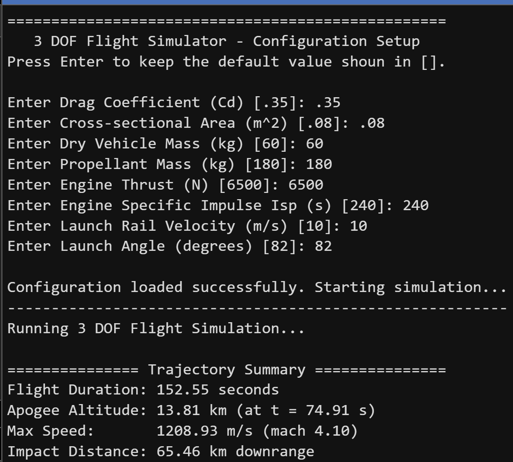
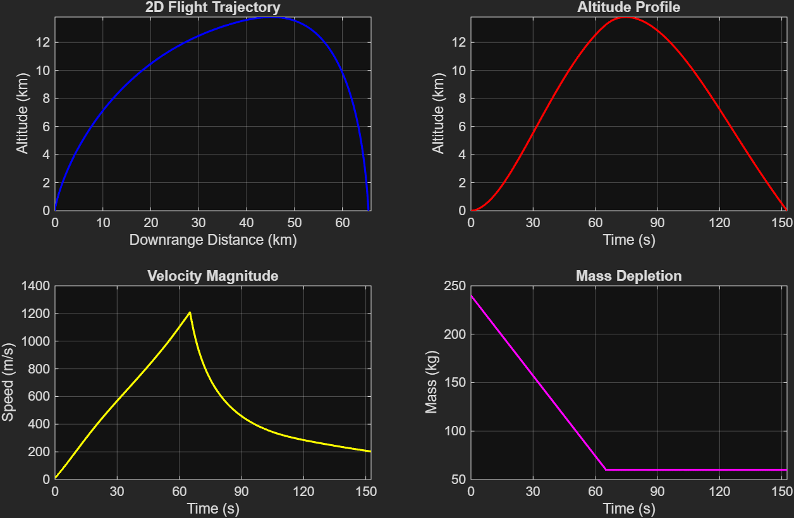
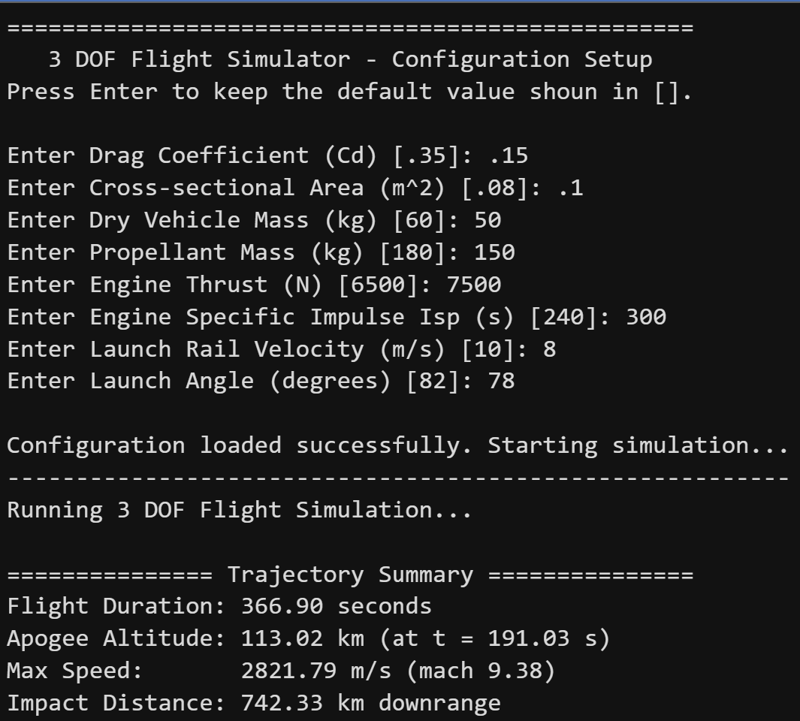
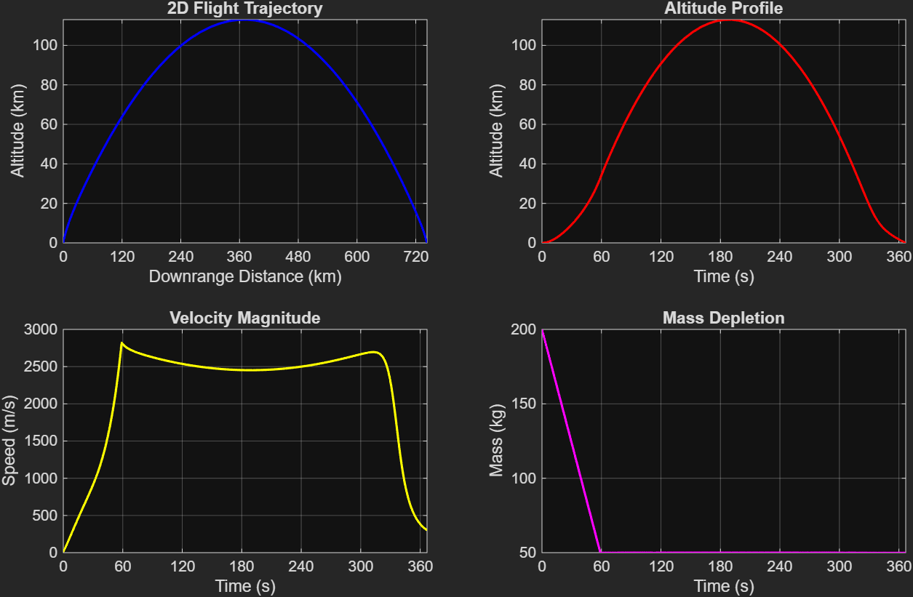
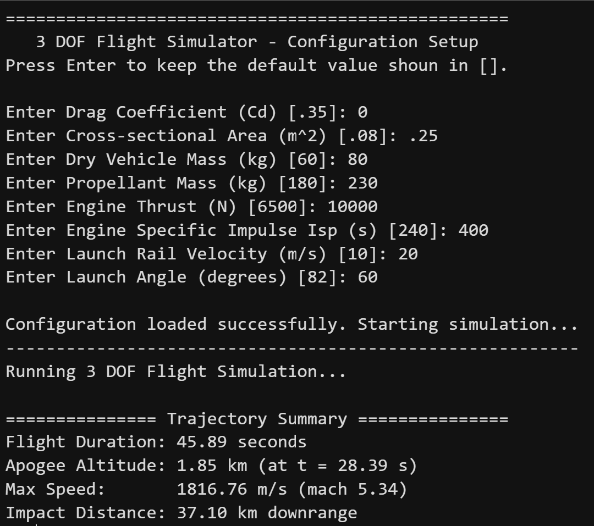
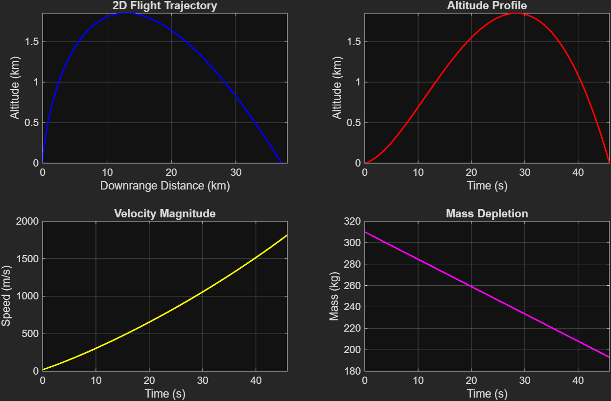

# 3 DOF Point-Mass Rocket Flight Simulator

A MATLAB-based 3-Degree-of-Freedom (3 DOF) point-mass trajectory simulator that models sub-orbital and atmospheric rocket flight profiles. The simulator evaluates 2D trajectories, aerodynamic drag using standard atmospheric models, inverse-square gravity degradation, and mass depletion through numerical integration.

---

## Key Features

- **Interactive Setup:** Prompts for vehicle parameters ($C_d$, cross-sectional area, dry mass, propellant mass, thrust, $I_{sp}$, initial velocity, pitch angle) with automatic default fallbacks.
- **US Standard Atmosphere 1976:** Computes density ($\rho$) and speed of sound ($a$) up to $86\text{ km}$, defaulting to vacuum flight ($\text{drag} = 0$) above the mesosphere.
- **Inverse-Square Gravity:** Calculates altitudinal degradation of gravitational acceleration ($g$) for accurate high-altitude sub-orbital trajectories.
- **Automated Event Detection:** Uses MATLAB `ode45` event location (`event_ground_impact.m`) to terminate integration precisely at ground impact ($z = 0$).
- **Dynamic Plots:** Automatically scales time ($t$) and distance ($x$) axis ticks and limits based on total flight duration and maximum downrange position.

---

## Simulation Profiles & Performance Plots

### Test Case 1
<p align="center">
  
  
</p>

---

### Test Case 2
<p align="center">
  
  
</p>

---

### Test Case 3
<p align="center">
  
  
</p>

---

## Technical Specifications

| Parameter | Description |
| :--- | :--- |
| **Integrator** | `ode45` (Runge-Kutta 4th/5th Order) |
| **State Vector ($y$)** | $[x, z, v_x, v_z, m]^T$ |
| **Atmosphere Model** | US Standard Atmosphere 1976 ($0 - 86\text{ km}$) |
| **Gravity Model** | Inverse-square altitudinal degradation |
| **Termination Event** | Ground impact ($z \le 0\text{ m}, \dot{z} < 0$) |

---

## File Architecture

```text
├── main.m                  # Top-level driver script & plot visualization
├── src/
│   ├── config.m            # Interactive setup & default configuration loader
│   ├── dynamics.m          # Differential equations of motion & state derivatives
│   ├── event_ground_impact.m # ODE event handler for ground impact
│   ├── gravity_model.m     # Altitudinal gravity degradation model
│   ├── solver.m            # Integration wrapper for ode45
│   └── std_atmosphere.m    # US Standard Atmosphere 1976 implementation
└── README.md               # Project documentation
